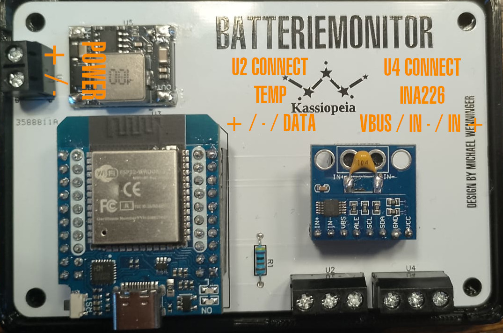

# Battery Monitor with INA226 and SenseESP

## Overview
This project is a DIY battery monitor for our trawler. It uses an ESP32 to measure current, voltage, and power with the INA226 sensor. The collected data is integrated into Signal K via SenseESP. Additionally, a OneWire temperature sensor is used to monitor battery temperature.

## Why High-Side Current Sensing?

High-side current sensing means placing the shunt resistor between the positive battery terminal and the load. This method has several advantages:

- It ensures that all current drawn from the battery is accurately measured, avoiding errors caused by multiple ground paths.
- It prevents ground loops, which can introduce noise and affect measurement accuracy.
- It is safer for systems with multiple ground connections and helps maintain proper system grounding.
- Modern sensors like the INA226 are designed for high-side sensing, providing better accuracy and compatibility with high-voltage applications.

## What is Signal K?
[Signal K](https://signalk.org/) is an open data format for marine electronics. It enables the integration and exchange of sensor data between various devices and applications on board a boat.

## What is SenseESP?
[SenseESP](https://github.com/SignalK/SensESP) is an open-source framework that simplifies the development of sensors that transmit their data to a Signal K server via Wi-Fi. It is based on the ESP32 and uses a modular architecture for flexible customization.

## Features
- Measurement of battery voltage, current, and power with INA226
- Calculation of the state of charge (SoC) based on battery type and voltage
- Calculation of remaining amp-hours (Ah) and estimated runtime
- Configurable battery parameters via the SenseESP web UI
- Alarm notifications for shunt overvoltage, bus overvoltage, and power limits
- Temperature monitoring via a OneWire sensor (e.g., DS18B20)

## Hardware Requirements
- **ESP32 D1 Mini** – Microcontroller
- **INA226 CJMCU** – Current sensor
- **DS18B20** – Temperature sensor
- **3A Mini DC-DC Buck Step Down Converter** – Voltage converter
- **Shunt resistor** – For current measurement (adapted to the maximum current)

## Terminal Assignments
| Terminal | Label             | Description            |
|----------|------------------|------------------------|
| **U1**   | Power IN         | + / - (6 - 32V)       |
| **U2**   | Temperature Sensor | + / - / Data          |
| **U4**   | INA226           | VBUS / IN - / IN +    |

## Signal K Data Points
- `electrical.batteries.<battery_name>.voltage` – Battery voltage in V
- `electrical.batteries.<battery_name>.current` – Battery current in A
- `electrical.batteries.<battery_name>.power` – Battery power in W
- `electrical.batteries.<battery_name>.stateOfCharge` – State of charge in %
- `electrical.batteries.<battery_name>.ampHours` – Remaining Ah
- `electrical.batteries.<battery_name>.timeToGo` – Remaining time in seconds
- `electrical.batteries.<battery_name>.temperature` – Battery temperature in °K
- `electrical.batteries.<battery_name>.alerts.shuntOverVoltage` – Alarm for shunt overvoltage
- `electrical.batteries.<battery_name>.alerts.busOverVoltage` – Alarm for bus overvoltage
- `electrical.batteries.<battery_name>.alerts.powerOverLimit` – Alarm for power limit exceeded

## Installation
### 1. Preparation
- Install PlatformIO (recommended)
  - [PlatformIO IDE for VSCode](https://platformio.org/install/ide?install=vscode)
  - [PlatformIO IDE for Atom](https://platformio.org/install/ide?install=atom)
  - [PlatformIO Core (CLI)](https://docs.platformio.org/en/latest/core/installation.html)
- Install required libraries:
  - [SignalK/SenseESP](https://github.com/SignalK/SensESP)
  - [sensesp/OneWire](https://github.com/PaulStoffregen/OneWire)
  - [INA226](https://github.com/RobTillaart/INA226)

### 2. Clone the repository
- Clone or download this repository to your local machine:
  ```sh
  git clone https://github.com/YourUsername/Batteriemonitor.git
  cd Batteriemonitor
  ```

### 3. Upload the code
Open the project in PlatformIO.
Upload the code to your ESP32.

### 4. Configure SenseESP
After the first start, the ESP32 will open an access point.
Connect to the network and enter the Wi-Fi credentials (Wi-Fi password: thisisfine).
Use the SenseESP web UI to configure the battery (see Configuration) and connect the ESP32 to the network where the Signal K server is running.
The data should now appear on the Signal K server under the configured paths.

## Configuration
The following parameters can be adjusted via the SenseESP web UI:
- Battery type (LiFePO4, AGM, Gel, Lead-Acid)
- Battery voltage (12V or 24V)
- Battery capacity in Ah
- Maximum shunt current
- Shunt voltage in mV
- Battery name for Signal K

**After each configuration change, the ESP32 must be restarted.**

## Usage
- Once set up, the ESP32 continuously transmits measurement values to Signal K.
- Configuration changes can be made via the web UI.
- Alarm notifications are triggered when defined thresholds are exceeded.

### Hardware Installation Notes
**Shunt Resistor**

- The shunt resistor must be installed on the high side of the battery. This means that the shunt is placed between the positive battery terminal and the load.
- Connect the positive battery terminal to one end of the shunt resistor.
- Connect the other end of the shunt resistor to the load (e.g., the consumer or the charger).
- Ensure that all connections are tight and secure to ensure accurate measurements.

**INA226 Sensor**

- Connect the INA226 sensor to the shunt resistor according to the schematic.
- Ensure that the voltage and current measurement lines are connected correctly:
  - `VIN+` of the INA226 to the end of the shunt connected to the positive battery terminal.
  - `VIN-` of the INA226 to the end of the shunt connected to the load.
  - `VBUS` connected to the positive battery terminal.
- Connect the INA226 sensor to the ESP32 according to the schematic.

**ESP32**

- Connect the ESP32 to the INA226 sensor and the OneWire temperature sensor according to the schematic.
- Ensure that the ESP32 is properly powered (e.g., via a DC-DC Buck Step Down Converter).

**PCB**

- To facilitate the connection of the components, you can use the Gerber files in the gerber folder to order a suitable PCB.



### Enclosure

In the `/3d-files` folder, you will find STEP files for a suitable enclosure that you can print to protect and mount the finished PCB.

## Used Components
- [ESP32 D1 Mini](https://de.aliexpress.com/item/1005006267267848.html)
- [INA226 CJMCU](https://de.aliexpress.com/item/1005001972537281.html)
- [3A Mini DC-DC Buck Step Down Converter](https://de.aliexpress.com/item/1005005505907937.html)
- [DS18B20 Temperature Sensor](https://de.aliexpress.com/item/1005005488542048.html)

## Repository Files
- **`/gerber`** – Contains Gerber files for the PCB.
- **`/schematic`** – Contains the circuit diagram.
- **`/3d-files`** – Contains the STEP files for a suitable enclosure.

## License
- **Software:** [GNU General Public License v3.0](LICENSE)  
- **Hardware:** [CERN Open Hardware Licence v2 - Strongly Reciprocal](LICENSE-HARDWARE)

## Acknowledgments
This project is based on the [Battery Monitor Project by Techstyleuk](https://github.com/Techstyleuk/SensESP_3_Battery_Monitor).

