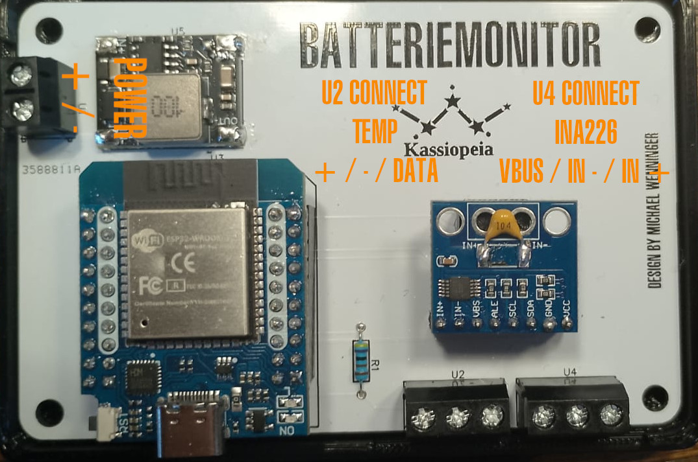

# Batteriemonitor mit INA226 und SenseESP

## Überblick
Dieses Projekt ist ein DIY-Batteriemonitor für unseren Trawler. Es nutzt einen ESP32, um mit dem INA226-Sensor Strom, Spannung und Leistung zu messen. Die erfassten Daten werden über SenseESP in Signal K integriert. Zudem wird ein OneWire-Temperatursensor zur Überwachung der Batterietemperatur verwendet.

## Warum High-Side-Strommessung?
Die High-Side-Strommessung bedeutet, dass der Shunt-Widerstand zwischen dem positiven Batteriepol und der Last platziert wird. Diese Methode hat mehrere Vorteile:
- Sie stellt sicher, dass der gesamte von der Batterie gezogene Strom genau gemessen wird, wodurch Fehler durch mehrere Erdungspfade vermieden werden.
- Sie verhindert Erdschleifen, die Rauschen einführen und die Messgenauigkeit beeinträchtigen können.
- Sie ist sicherer für Systeme mit mehreren Erdungsverbindungen und hilft, eine ordnungsgemäße Systemerdung aufrechtzuerhalten.
- Moderne Sensoren wie der INA226 sind für die High-Side-Messung ausgelegt und bieten eine höhere Genauigkeit sowie Kompatibilität mit Hochspannungsanwendungen.

## Was ist Signal K?
[Signal K](https://signalk.org/) ist ein offenes Datenformat für die maritime Elektronik. Es ermöglicht die Integration und den Austausch von Sensordaten zwischen verschiedenen Geräten und Anwendungen an Bord eines Boots.

## Was ist SenseESP?
[SenseESP](https://github.com/SignalK/SensESP) ist ein Open-Source-Framework, das die einfache Entwicklung von Sensoren ermöglicht, die ihre Daten über WLAN an einen Signal K-Server senden. Es basiert auf dem ESP32 und nutzt eine modulare Architektur für flexible Anpassungen.

## Funktionen
- Messung von Batteriespannung, Strom und Leistung mit INA226
- Berechnung des Ladezustands (SoC) basierend auf Batterietyp und Spannung
- Berechnung der verbleibenden Amperestunden (Ah) und der verbleibenden Laufzeit
- Konfigurierbare Batterieparameter über die Web-UI von SenseESP
- Alarmmeldungen für Shunt-Überspannung, Bus-Überspannung und Leistungsgrenzen
- Temperaturüberwachung über OneWire-Sensor (z.B. DS18B20)

## Hardware-Anforderungen
- **ESP32 D1 Mini** – Mikrocontroller
- **INA226 CJMCU** – Stromsensor
- **DS18B20** – Temperatursensor
- **3A Mini DC-DC Buck Step Down Converter** – Spannungswandler
- **Shunt-Widerstand** – zur Strommessung (angepasst an den maximalen Strom)

## Klemmenbelegung
| Klemme | Bezeichnung         | Beschreibung            |
|--------|---------------------|-------------------------|
| **U1** | Power IN           | + / - (6 - 32V)        |
| **U2** | Temperatursensor   | + / - / Data           |
| **U4** | INA226             | VBUS / IN - / IN +     |

## Signal K Datenpunkte
- `electrical.batteries.<battery_name>.voltage` – Batteriespannung in V
- `electrical.batteries.<battery_name>.current` – Batteriestrom in A
- `electrical.batteries.<battery_name>.power` – Batterieleistung in W
- `electrical.batteries.<battery_name>.stateOfCharge` – Ladezustand in %
- `electrical.batteries.<battery_name>.ampHours` – verbleibende Ah
- `electrical.batteries.<battery_name>.timeToGo` – verbleibende Zeit in Sekunden
- `electrical.batteries.<battery_name>.temperature` – Batterietemperatur in °K
- `electrical.batteries.<battery_name>.alerts.shuntOverVoltage` – Alarm bei Shunt-Überspannung
- `electrical.batteries.<battery_name>.alerts.busOverVoltage` – Alarm bei Bus-Überspannung
- `electrical.batteries.<battery_name>.alerts.powerOverLimit` – Alarm bei Leistungsüberschreitung

## Installation
### 1. Vorbereitung
- PlatformIO installieren (empfohlen)
  - [PlatformIO IDE für VSCode](https://platformio.org/install/ide?install=vscode)
  - [PlatformIO IDE für Atom](https://platformio.org/install/ide?install=atom)
  - [PlatformIO Core (CLI)](https://docs.platformio.org/en/latest/core/installation.html)
- Benötigte Bibliotheken installieren:
  - [SignalK/SenseESP](https://github.com/SignalK/SensESP)
  - [sensesp/OneWire](https://github.com/SensESP/OneWire)
  - [INA226](https://github.com/RobTillaart/INA226)

### 2. Repository klonen
- Klonen oder laden Sie dieses Repository auf Ihren lokalen Rechner:
  ```sh
  git clone https://github.com/mw8010/Batteriemonitor.git
  cd Batteriemonitor
  ```

### 3. Code hochladen
- Öffnen Sie das Projekt in PlatformIO.
- Laden Sie den Code auf Ihren ESP32.

### 3. SensESP konfigurieren
- Nach dem ersten Start öffnet der ESP32 einen Access Point.
- Verbinden Sie sich mit dem Netzwerk und geben Sie die WLAN-Zugangsdaten ein (WLAN Passwort: thisisfine).
- Über die Web-UI von SensESP können Sie die Batterie konfigurieren (siehe Konfiguration) und den ESP32 in das Netzwerk einbinden, in dem der Signal K Server läuft.
- Die Daten sollten nun im Signal K Server unter den konfigurierten Pfaden erscheinen.

## Konfiguration
Die folgenden Parameter können über die Web-UI von SenseESP angepasst werden:
- Batterietyp (LiFePO4, AGM, Gel, Bleisäure)
- Batteriespannung (12V oder 24V)
- Batteriekapazität in Ah
- Maximalstrom des Shunts
- Shunt-Spannung in mV
- Batteriename für Signal K

**Nach jeder Änderung der Konfiguration muss der ESP32 neu gestartet werden.**

## Nutzung
- Nach erfolgreicher Einrichtung überträgt der ESP32 kontinuierlich die Messwerte an Signal K.
- Änderungen an der Konfiguration können über die Web-UI vorgenommen werden.
- Alarmmeldungen werden bei Über- oder Unterschreiten der definierten Grenzwerte ausgelöst.

## Hinweise zur Hardware-Installation
**Shunt-Widerstand**
- Der Shunt-Widerstand muss auf der High-Seite der Batterie installiert werden. Das bedeutet, dass der Shunt zwischen dem positiven Batteriepol und der Last platziert wird.
- Verbinden Sie den positiven Batteriepol mit einem Ende des Shunt-Widerstands.
- Verbinden Sie das andere Ende des Shunt-Widerstands mit der Last (z.B. dem Verbraucher oder dem Ladegerät).
- Stellen Sie sicher, dass alle Verbindungen fest und sicher sind, um genaue Messungen zu gewährleisten.

**INA226-Sensor**
- Verbinden Sie den INA226-Sensor mit dem Shunt-Widerstand gemäß dem Schaltplan.
- Stellen Sie sicher, dass die Spannungs- und Strommessleitungen korrekt angeschlossen sind:
  - `VIN+` des INA226 an das Ende des Shunt, das mit dem positiven Batteriepol verbunden ist.
  - `VIN-` des INA226 an das Ende des Shunts, das mit der Last verbunden ist.
  - `VBUS` mit dem positiven Batteriepol verbunden ist.
- Verbinden Sie den INA226-Sensor mit dem ESP32 gemäß dem Schaltplan.

**ESP32**
- Verbinden Sie den ESP32 mit dem INA226-Sensor und dem OneWire-Temperatursensor gemäß dem Schaltplan.
- Stellen Sie sicher, dass der ESP32 korrekt mit Strom versorgt wird. (z.B. über einen DC-DC Buck Step Down Converter)

**Platine**
- Zur leichteren Verbindung der Komponenten können Sie die Gerber-Dateien im Ordner `/gerber` verwenden, um eine passende Platine zu bestellen.



**Gehäuse**
- Im Ordner `/3d-files` finden Sie STEP-Dateien für ein passenses Gehäuse, das Sie ausdrucken können, um die fertige Platine zu schützen und zu montieren.

## Verwendete Komponenten
- [ESP32 D1 Mini](https://de.aliexpress.com/item/1005006267267848.html)
- [INA226 CJMCU](https://de.aliexpress.com/item/1005001972537281.html)
- [3A Mini DC-DC Buck Step Down Converter](https://de.aliexpress.com/item/1005005505907937.html)
- [DS18B20 Temperatursensor](https://de.aliexpress.com/item/1005005488542048.html)

## Dateien im Repository
- **`/gerber`** – Enthält die Gerber-Dateien für die Platine.
- **`/schaltplan`** – Enthält den Schaltplan.
- **`/3d-files`** - Enthält die STEP-Dateien für ein passendes Gehäuse.

## Lizenz
- **Software:** GNU General Public License v3.0
- **Hardware:** CERN Open Hardware Licence v2 - Strongly Reciprocal

## Danksagung
Dieses Projekt basiert auf dem [Battery Monitor Project von Techstyleuk](https://github.com/Techstyleuk/SensESP_3_Battery_Monitor).
